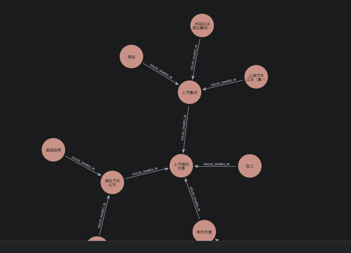

# GraphRAG 多跳问答系统 - 实验结果分析报告
目前虽然代码能跑起来，并且也创建了如下的图谱

但是，不知为何，在代码调试过程中，出现如下两个报错：
问题一，处理 上汽通用五菱的最大股东是谁 这个问题时，

提示：查询处理时发生错误: 'KnowledgeGraphQueryEngine' object has no attribute 'storage_context'

但是我跟着
```python
    _kg_query_engine = KnowledgeGraphQueryEngine(
        storage_context = StorageContext.from_defaults(graph_store=graph_store),
        llm=config.Settings.llm,
        graph_query_synthesis_prompt=DEFAULT_GRAPH_QUERY_PROMPT,
        verbose=True, # 打印生成的 Cypher 查询，便于调试
    )
```
这段代码的源码看，实际上有storage_context这个属性的，不知道为啥会一直提示上述问题

问题二，处理其他非最大股东问题时，比如上汽通用五菱的成立时间 时，会出现如下报错
```bash
当前用户问题: 上汽通用五菱的成立时间是什么时候？
Graph Store Query:
为了查询与“上汽通用五菱”相关的信息并生成查询图谱，我们可以从以下几个维度构建知识图谱的节点和关系。以下是基于公开信息构建的“上汽通用五菱”知识查询图谱结构：                                                                          
                                                                                                                                                                                                                                    
---                                                                                                                                                                                                                                 
                                                                                                                                                                                                                                    
### 🌐 **查询图谱：上汽通用五菱（SAIC-GM-Wuling）**                                                                                                                                                                                 
                                                                                                                                                                                                                                    
#### 1. **核心实体（中心节点）**                                                                                                                                                                                                    
- **企业名称**：上汽通用五菱汽车股份有限公司（SAIC-GM-Wuling Automobile Co., Ltd.）                                                                                                                                                 
- **简称**：上汽通用五菱 / SGMW                                                                                                                                                                                                     
- **成立时间**：2002年11月18日                                                                                                                                                                                                      
- **总部地点**：中国广西壮族自治区柳州市                                                                                                                                                                                            
                                                                                                                                                                                                                                    
---                                                                                                                                                                                                                                 
                                                                                                                                                                                                                                    
#### 2. **股东与股权结构（关联企业节点）**                                                                                                                                                                                          
```mermaid                                                                                                                                                                                                                          
graph LR                                                                                                                                                                                                                            
    A[上汽通用五菱] --> B[上汽集团 SAIC Motor]                                                                                                                                                                                      
    A --> C[通用汽车 General Motors]                                                                                                                                                                                                
    A --> D[广西汽车集团 Guangxi Auto Group]                                                                                                                                                                                        
```                                                                                                                                                                                                                                 
- **上汽集团（SAIC Motor）**：持股约50.1%                                                                                                                                                                                           
- **通用汽车（General Motors）**：持股约44%                                                                                                                                                                                         
- **广西                                                                                                                                                                                                                            
查询处理时发生错误: {code: Neo.ClientError.Statement.SyntaxError} {message: Invalid input '为了查询与': expected 'ALTER', 'ORDER BY', 'CALL', 'USING PERIODIC COMMIT', 'CREATE', 'LOAD CSV', 'START DATABASE', 'STOP DATABASE', 'DEALLOCATE', 'DELETE', 'DENY', 'DETACH', 'DROP', 'DRYRUN', 'FINISH', 'FOREACH', 'GRANT', 'INSERT', 'LIMIT', 'MATCH', 'MERGE', 'NODETACH', 'OFFSET', 'OPTIONAL', 'REALLOCATE', 'REMOVE', 'RENAME', 'RETURN', 'REVOKE', 'ENABLE SERVER', 'SET', 'SHOW', 'SKIP', 'TERMINATE', 'UNWIND', 'USE' or 'WITH' (line 1, column 1 (offset: 0))
"为了查询与“上汽通用五菱”相关的信息并生成查询图谱，我们可以从以下几个维度构建知识图谱的节点和关系。以下是基于公开信息构建的“上汽通用五菱”知识查询图谱结构："
 ^}
INFO:     127.0.0.1:63015 - "POST /api/query HTTP/1.1" 500 Internal Server Error
```
这个问题目前也不是很清楚该如何处理，请帮忙老师帮忙指导下。
