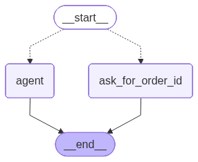
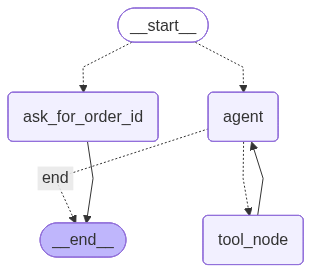
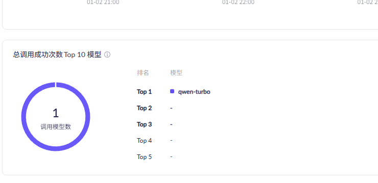

# 基于langChain+langGraph实现小型智能客服分析报告
## 1.项目概述
该工程，初步实现基于langChain和langGraph组合的智能系统。基本满足作业的相关要求，实现了作业要求的核心内容。

不过，最后更新模型名称，发现有些问题，这个在后文在详细描述

## 2.核心功能分析
### 2.1 agent_service
代码路径： agentservice.py

功能分析：

1.  实现了agent级别的tool集成以及调用，其中tool包括查询昨天时间、查询订单信息、订单退款等功能
2.  基于langChain1.2.0,并结合官网的封装方式，将系统提示词封装进agent中
3.  实现了基础的对话功能，但是看官网中未出现LCELL的链式表达，因此，未严格按照阶段一的要求Prompt → LLM → OutputParser形式实现

### 2.2 graph_service
代码路径: graphservice.py

功能分析：

1. 基于langGraph1.0.5，并参考官网的例子，实现了阶段二要求的相关流程
2. 通过分别调用call_model和call_agent方法，实现两种不同的流程图
<!-- 弹性布局实现并排，每张图占50%宽度 -->
<div style="display: flex; gap: 20px; margin: 20px 0;">
  <div style="flex: 1; text-align: center;">
    <p><b>agent_graph.png（基础流程）</b></p>
    
  </div>
  <div style="flex: 1; text-align: center;">
    <p><b>llm_graph.png（带闭环流程）</b></p>
    
  </div>
</div>

### 2.3 热更新
通过hot-update接口，实现了agent中llm的模型变更。

## 3.实验的一些问题
### 3.1 在agent已经封装了tool的调用能力，在langGraph又封装一遍。
通过两个流程的代码比较，发现llm_graph这个流程中，直接使用LLM本身的toolCall能力去绑定tool。

参见如下代码
```python
    def _call_model(self, state: MessagesState):
        """
        直接调用大模型+工具的方式来处理
        """
        print("--- [Node] Agent: Thinking... ---")
        try:
            llm = self.service_manager.get_model()
            tools = self.service_manager.get_tools()
            model_with_tools = llm.bind_tools(tools)
            response = model_with_tools.invoke(state['messages'])
            return {"messages": [response]}
        except Exception as e:
            print(f"模型调用错误: {e}")
            return {"messages": [AIMessage(content="抱歉，系统出现错误，请稍后再试。")]}
```
这样造成在agent中封装的系统提示词失效。需要额外封装系统提示词。
感觉有点多余了。

想知道这样有什么好处？
一般实际工作中，是langGraph-->llm+tools的方式多，还是 langGraph --> agent 的方式多？

### 3.2 ChatTongyi这个包似乎有问题，模型始终默认是qwen-turbo
无论是环境变量里初始化成 qwen-max，还是通过hot-update方法，都无法更新
```console
[热更新] 正在更新LLM模型为: qwen-max
--- 当前服务状态 ---
  模型: qwen-max
  工具: ['get_date_from_question', 'query_order', 'apply_refund']
--------------------
INFO:     127.0.0.1:58647 - "POST /api/hot-update HTTP/1.1" 200 OK
INFO:     127.0.0.1:64335 - "GET /api/health HTTP/1.1" 200 OK
当前用户问题: 今天几号？
当前系统回复： {'messages': [HumanMessage(content=[{'type': 'text', 'text': '今天几号？'}], additional_kwargs={}, response_metadata={}, id='461b3a94-ece8-4a87-aa14-7c9365da1a08'), AIMessage(content='您好，我是阿尔弗雷德,我是您的智能客服助手，有什么可以帮助你？', additional_kwargs={}, response_metadata={'model_name': 'qwen-turbo', 'finish_reason': 'stop', 'request_id': '9cd51071-48e4-4a34-804d-c81e01cff2f9', 'token_usage': {'input_tokens': 494, 'output_tokens': 18, 'prompt_tokens_details': {'cached_tokens': 0}, 'total_tokens': 512}}, id='lc_run--019b7fdf-0ab4-72b0-b284-7c423691b63b-0')]}
INFO:     127.0.0.1:50572 - "POST /api/chatAgent HTTP/1.1" 200 OK
当前用户问题: 今天是几号？
--- [工具调用] 正在解析时间段: 今天是几号？ ---
当前系统回复： {'messages': [HumanMessage(content=[{'type': 'text', 'text': '今天是几号？'}], additional_kwargs={}, response_metadata={}, id='c24bc8c6-8ede-44de-b98e-5ce4156ce8e9'), AIMessage(content='', additional_kwargs={'tool_calls': [{'function': {'arguments': '{"question": "今天是几号？"}', 'name': 'get_date_from_question'}, 'id': 'call_205d4cd7b8854fdc819ee1', 'index': 0, 'type': 'function'}]}, response_metadata={'model_name': 'qwen-turbo', 'finish_reason': 'tool_calls', 'request_id': '9487b29d-6a42-4f2c-83f2-efa907a0b63b', 'token_usage': {'input_tokens': 495, 'output_tokens': 25, 'prompt_tokens_details': {'cached_tokens': 0}, 'total_tokens': 520}}, id='lc_run--019b7fdf-45a8-76a2-9787-e167f59402a4-0', tool_calls=[{'name': 'get_date_from_question', 'args': {'question': '今天是几号？'}, 'id': 'call_205d4cd7b8854fdc819ee1', 'type': 'tool_call'}]), ToolMessage(content='2026-01-03', name='get_date_from_question', id='77c00929-353d-48f4-97f0-cb96cefa8175', tool_call_id='call_205d4cd7b8854fdc819ee1'), AIMessage(content='今天是2026年1月3日。', additional_kwargs={}, response_metadata={'model_name': 'qwen-turbo', 'finish_reason': 'stop', 'request_id': '72dc7aea-0b9f-4ab5-afbe-78c041e4ab7f', 'token_usage': {'input_tokens': 544, 'output_tokens': 12, 'prompt_tokens_details': {'cached_tokens': 0}, 'total_tokens': 556}}, id='lc_run--019b7fdf-4830-76f1-b17c-8497466792ea-0')]}
INFO:     127.0.0.1:51214 - "POST /api/chatAgent HTTP/1.1" 200 OK
INFO:     127.0.0.1:61351 - "GET /api/health HTTP/1.1" 200 OK

```
看模型token的消耗，只有qwen-turbo的模型在消耗token


## 4.实验总结
1. 本实验已经初步实现了一个智能客服的基础功能，后续可以基于该代码，定制化自己工作中真实的客服场景。
2. 代码还未实现分层次展示，所有代码都集中在项目的根文件夹中，比较乱，后续熟悉python后，可以调整。
3. 目前一直使用fastApi的方式，提供web服务，不知道实际生产应该怎么做。模块四虽然开头提了langServer，不过没看到具体怎么用，这个需要研究
4. tools中并未实现真的意义上的调其他系统的接口方式，查询真实数据。
5. 缺少前端页面展示。目前仍然是fastapi的方式，实际上，并未真正意义实现多轮对话机制。
